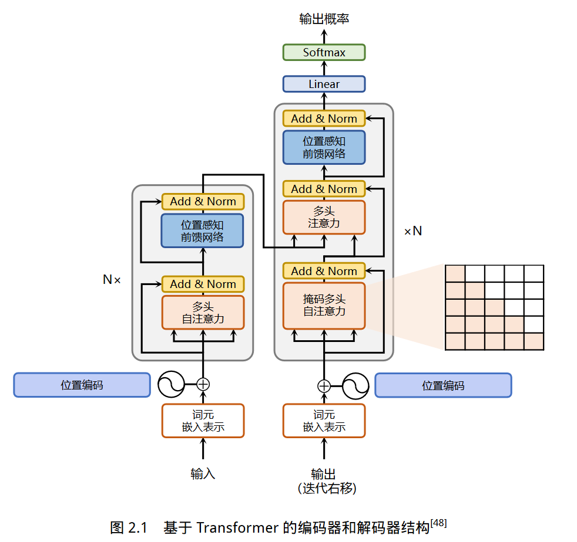
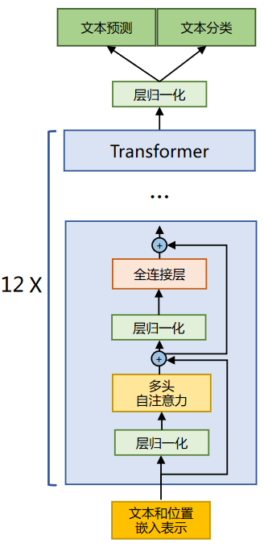
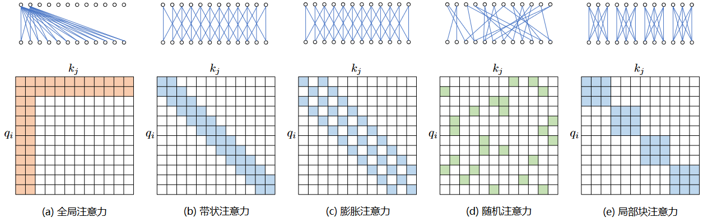

# Chapter2 Large Language Model Fundamentals

## 2.1 Transformer Model

* `Attention Layer`：Integrate contextual semantics using multi-head attention mechanisms.
* `Position-wise FFN`：Perform more complex transformations on the representation of each word in the input text sequence through fully connected layers.
* `Residual Connection`：Corresponding to the `Add` module in the middle. This make the information flow more efficient and benefits model optimization.
* `Layer normalization`：Corresponding to the `Norm` module in the middle.  Perform layer normalizaiton on the representation sequence, which also stabilizes the optimization.

### 2.1.1 Enbedding Representation Layer

For each input text sequence, first convert each word into its corresponding vector representation through the input embedding layer. Before sending it to encoder for modeling its contextual sematics, a very significant operation is to add positional encoding features to the word embeddings and then send to subsequent modules for futher processing. Transformer uses sine and cosine fuctions of different frequencies to set the positional encoding.
$$
\text{PE}(\text{pos}, 2i) = \sin(\frac{\text{pos}}{10000^{2i/d}}) \\
\text{PE}(\text{pos}, 2i + 1) = \cos(\frac{\text{pos}}{10000^{2i/d}})
$$
where $pos$ represents the position of the word, $2i$ and $2i+1$ represent the corresponding dimensions in the positional encoding vector, and $d$ corresponds to the total dimensions of the positional encoding.

>THINK： WHY IS POSITION ENCODING DESIGNED LIKE THIS. 
>
>* The range of sine and cosine fuction is $[-1,+1]$, so adding the positional encoding to the original word embeddings will not cause the results to deviate too far, thereby preserving the original semantic information of the words.
>* According to the basic properties of trigonometric functions, it can be known that the coding of the $pos + k$ position is a linear combination of the coding of the pos position, which means that the position coding contains the distance information between words. ??

The `positional encoding` reference code implemented using `Pytorch`  is in this [file](./transformer/PositionalEncoder.py).

### 2.1.2 Attention Layer

To further model dependencies on contextual semantics, it is essential to introduce three elements involved in self-attention mechanisms: Query, Key and Value. In the process of encoding the representation of each word in the input sequence, these three elements are used to calculate the weight score corresponding to the context word. Specifically, through three linear transformations $W^Q \in R^{d\times d_q},W^K \in R^{d\times d_k},W^V \in R^{d\times d_v}$, each word in the input sequence is represented by $x_i$, which is converted into its corresponding $q_i \in R^{d_k}, k_i \in R^{d_k}, v_i \in R^{d_v}$

In order to obtain the context information that needs to be paid attention to when encoding the word $x_i$, the matching scores $q_i \cdot k_1, q_i \cdot k_2,...,q_i \cdot k_t$. In order to prevent the gradient explosion and poor convergence efficiency caused by excessive matching scores in the subsquence `Softmax` calulation process. These scores are divided by the scaling factor $\sqrt{d}$ to stablize the optimization.
$$
Z = \text{Attention}(Q, K, V) = \text{Softmax}(\frac{QK^T}{\sqrt{d}})V
$$

In order to further enchance the ability of self-attention mechanism to aggregate context information,  a multi-head attention mechanism is proposed.  Specifically, the representation $x_i$ of each word in the context is mapped to different representation subspaces. Finally, the linear transformation $W^O \in R^{(Nd_v) \times d}$ is used to synthesize the context representations in different subspaces and form the final output of the self-attention layer $\{x_i \in R^d\}^t_{i=1}$ .

The `MultiHeadAttention` reference code implemented using Pytorch  is in this [file](./transformer/MultiHeadAttention.py).

### 2.1.3 Feedforward Layer

Feedforward layer accepts the output of the self-attention sublayers as input, and performs more complex nonlinear transformations on the input through a two-layer fully connected network with a ReLu activation function.
$$
\text{FFN}(x) = \text{Relu}(xW_1 + b_1)W_2+b_2
$$
The experimental results show that increasing the dimension of hidden state of the feed-forward sub-layer is conducive to improving the quality of the final translation results. Therefore, the dimension of the hidden state of the feed-forward sub-layer is generally larger than that of self-attention sub-layer.

The `FeedForward Layer` reference code implemented using Pytorch  is in this [file](./transformer/FeedForward.py).

### 2.1.4 Residual connection and layer normalization

The network structure composed of Transformer structures is usually quite large. The encoder and decoder are both composed of many layers of basic Transformer blocks, and each layer contains complex nonlinear mappings, which makes the training of the model more difficult. Therefore, researchs have further introduced residual connection and layer normalization techniques in Transformer blocks to futher improve the stability of training.

Specifically, the residual connection mainly refers to use of a direct channel to connect the input of the corresponding sub-layer directly to the output, so as to avoid the potential gradient disappearance problem in the optimization process due to the deep network.
$$
x^{l+1} = f(x^l) + x^l
$$
In addition, in order to further stablilize the input and output range of each layer within a reasonable range, the layer normalization technique is further introduced into each Transformer blocks.
$$
\text{LN}(x) = \alpha \cdot \frac{x - \mu}{\sigma} + b
$$
where $\mu$ and $\sigma$ denote the *mean* and *variance* respectively, which are used to shift and scale the data to a standard distribution with a mean of $0$ and a variance of $1$, and $\alpha$ and $\sigma$ are learnable parameters.

The `NormLayer` reference code implemented using Pytorch is in this [file](./transformer/NormLayer.py).

### 2.1.5 Encoder and Decoder structure

Compared with the encoder, the decoder is more complex. Specifically, the first of attention sub-layer of each Transformer block of the decoder is additionally added `Masked Multi-Head Attention`. This is mainly because in the process of translation, the encoder side is mainly used to encode the information of the source language sequence, which is completely known, so the encoder only needs to consider how to integrate the context semantic information. The decoder side, however, is responsible for generating the target language sequence. This generate process is autoregressive, that is, for the generation process of each word, only the target language sequence before the current word can be observed. Therefore, this additional mask is used to cover the subsequence text information in case the model directly sees the subsequnent text sequence during the training phase and cannot be effectively trained.

In addition, a Multi-Head Attention module is added to the decoder side, which used the `Cross-attention` method to simultaneously receive output from the ecoder side and the previous mask attension layer of the current Transformer block. The `Q` is projected through the output of the previous layer of the decoder, while the `K` and `V` are projected using the output of the encoder.

The `EncoderLayer` and `Encoder` reference code implemented using Pytorch is in this [file](./transformer/Encoder.py).

The `DecoderLayer` and `Decoder` reference code implemented using Pytorch is in this [file](./transformer/Decoder.py).

The `Transformer`  reference code implemented using Pytorch is in this [file](./transformer/Transformer.py).

## 2.2 Generative pre-trained language model GPT

Generative Pre-Training proposed by OpenAI in 2019 is one of the typical generative pre-training language models. The one-way language model composed of multi-layer Transformer is mainly divided into three parts: input layer, coding layer and output layer.

### 2.2.1 Unsupervised pre-training

Given a text sequence $w=w_1w_2...w_n$, GPT first maps it to a dense vector in the input layer.
$$
v_i = v_i^t + v_i^p
$$
where $v_i^t$ is the word vector of word $w_i$ and $v_i^p$ is the position vector of word $w_i$.  

After the input layer coding, the model obtains the representation vector sequence $v = v_1...v_n$, and then sends $v$ to the model coding layer. The encoding layer is composed of $L$ Transformer modules. Under the action of self-attention mechanism, each representation vector of each layer will contain the information of the previous position representation vector.
$$
h^{(L)} = \text{Transformer-Block}^{(L)}(h^{(0)})
$$
The output layer of GPT model predicts the conditional probability at each position based on the representation $h^{(L)}$ of the last layer. The calculation process can be expressed as:
$$
P(w_i | w_1,...w_{i-1}) = \text{Softmax}(W^eh_i^{(L)}+b^{out})
$$
where $W^e \in \mathbb{R}^{|\mathbb{V}|\times d}$ is the word vector matrix, and $|\mathbb B|$ is the vocabulary size.

The one-way language model is to input the text sequence $w$ according to the reading order, and use the conventional language model target to optimize the maximum likelihood estimation of $w$, so that it can make an accurate prediction of the current word according to the input historical sequence:
$$
\mathcal L^{PT}(w)= -\sum^n_{i=1}\log P(w_i|w_0...w_{i-1};\theta)
$$
where $\theta$ represents the model parameters.

### 2.2.2 Supervised downstream task fine-tuning

The purpose of downstream task fine-tuning is to adapt according to the characteristics of downstream tasks on the basis of general semantic representation. Downstream tasks usually need to be trained using labeled datasets, which are represented by $\mathbb D$. Each sample consists of a text sequence $x = x_1x_2...x_n$ with an input length of $n$ and a corresponding label $y$.

Firstly, the text sequence $x$ is input into the GPT model to obtain the hidden layer output $h_n^{(L)}$ corresponding to the last word of the last layer. On this basis, the label prediction result is obtained by combining the full connection layer transformation with the Softmax function.
$$
P(y|x_1...x_n)=\text{Softmax}(h^{L}_nW^y)
$$
where $W^y \in \mathbb R^{d \times k}$ represents fully connected layer parameter and $k$ is the number of labels. By optimizing the entire labled data set $\mathbb D$, the following objective function fine-tunes the downstream tasks: 
$$
\mathcal L^{FT}(\mathbb D) = -\sum_{(x,y)}\log P(y|x_1,...,x_n)
$$
In the process of fine-tuning downstream tasks, it is easy to make the model forget the general semantic knowledge representation learned in the pre-training stage by optimizing the task objectives, thus losing the versatility and generalization ability of the model and causing Catastrophic Forgetting problem.
$$
\mathcal L = \mathcal L^{FT}(\mathbb D) + \lambda \mathcal L^{PT}(\mathbb D)
$$
where value of $\lambda$ is $[0,1]$, which is used to adjust the proportion of pre-training task loss.

### 2.2.3 The practice of pre-trained language model based on HuggingFace

One of the most famous contributions of HuggingFace is the Transformer library, based on which researchers can quickly deploy trained models and implement new network structures. In this section, we will take the construction of BERT model as an example to introduce the construction and use of BERT model based on Huggingface. You can see the code in this [jupyter notebook](./bert.jupynb).

## 2.3 Large language model structure

This section will task the LLaMA model as an example to introduce the improvement of the large language model architecture on the original structure of Transformer, and introduce the attention mechanism optimization method with the largest proortion of space and time in the Transformer model structure.

### 2.3.1 Model structure of LLaMA

The difference between Llama and Transformer architecture includes the use of Pre-normalization and the use of RMSNorm normalization function, the activation function is replaced by SwiGLU, and the use of rotating position embedding (RoP). The overall Transformer architecture is similar to GPT-2.

#### 1. RMSNorm normalization function

In order to make the model training process more stable, GPT-2 introduces a pre-layer normalization method compared with GPT. The `RMSNorm` normalization function is also used in the layer normalization. The calculation formula for the input vetor $a$ `RMSNorm` function is as follows:
$$
RMS(a) = \sqrt{\frac{1}{n}\sum_{i=1}^n a_i^2} \\
\bar{a}_i = \frac{a_i}{RMS(a)}
$$
In addition, `RMSNorm` can also introduce a learnable scaling facor $g_i$ and an offset parameter $b_i$ to obtain $\bar{a}_i = \frac{a_i}{RMS(a)}g_i$.

The `RMSNorm`  reference code implemented using Pytorch is in this [file](./Llama/RMSNorm.py).

#### 2. SwiGLU activate function

The calculation formula for using FFN with SwinGLU activation function in the fully connection layer of LLaMA is as follows:
$$
\text{FFN}_{\text{SwiGLU}}(x, W, V, W_2) = \text{SwiGLU}(x,W,V)W_2 \\
\text{SwiGLU}(x,W,V) = \text{Swish}_\beta(xW) \otimes xV \\
\text{Swish}_\beta(x) = x \sigma(\beta x)
$$

#### 3.  Rotary Position Embedding (RoPE)

According to the geometric meaning of complex multiplication, the transformation is actually the corresponding vector rotation, so the position vector is called 'rotation position coding'. It can also be expressed in matrix form:
$$
f(q, m) = \begin{pmatrix} \cos m\theta & -\sin m\theta \\ \sin m\theta & \cos m\theta\end{pmatrix}\begin{pmatrix} q_0 \\ q_1\end{pmatrix}
$$
The phase-by-phase multiplication operation can be used to further accelerate the calculation speed.
$$
\boldsymbol{R}_{\Theta,m}^d\boldsymbol{x}=\begin{pmatrix}x_1\\x_2\\x_3\\x_4\\\vdots\\x_{d-1}\\x_d\end{pmatrix}\otimes\begin{pmatrix}\cos m\theta_1\\\cos m\theta_1\\\cos m\theta_2\\\cos m\theta_2\\\vdots\\\cos m\theta_{d/2}\\\cos m\theta_{d/2}\end{pmatrix}+\begin{pmatrix}-x_2\\x_1\\-x_4\\x_3\\\vdots\\-x_d\\x_{d-1}\end{pmatrix}\otimes\begin{pmatrix}\sin m\theta_1\\\sin m\theta_1\\\sin m\theta_2\\\sin m\theta_2\\\vdots\\\sin m\theta_{d/2}\\\sin m\theta_{d/2}\end{pmatrix}
$$
The `RoPE`  reference code implemented using Pytorch is in this [file](./Llama/RoPE.py).

### 2.3.2 Attention mechanism optimization

In the transformer structure, the time and storage complexity of the self-attention mechanism are squared with the length of the sequence, so it takes up a lot of computing device memory and consumes a lot of computing resources. Therefore, how to optimize the space-time complexity of the self-attention mechanism and enhance the computational efficiency is an important problem that the large language model needs to face. Some studies start from approximate attention, aiming at reducing attention computing and memory requrements, and propose methods including `sparse approximation` and `low-rank approximation`.

#### 1. Sparse approximation attention mechanism

The basic types of the location-based sparse attention mechanism are show as follows:

#### 2. FlashAttention

FlashAttention is already supported in PyTorch 2.0, using `torch.backends.cuda.enable _flash_sdp()` to enable or disable FlashAttention.

#### 3. Multi Query Attention

Multi query attention is a variant of multi-head attention. The main difference is that different attention heads share a set of keys and values in multi-query attention, and each head retains only one query parameter. Therefore, there is only one matrix of keys and values, which greatly reduces the memory footprint and makes it more efficient. 
